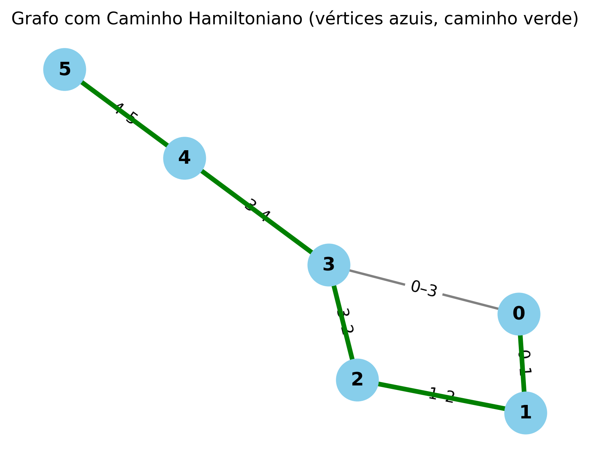

# Algoritmo para encontrar um Caminho Hamiltoniano em um grafo

## O que é este projeto?

Este projeto apresenta uma implementação em Python de um algoritmo capaz de identificar um Caminho Hamiltoniano em um grafo, quando este existe, e de visualizar o grafo gerado. Além disso, o projeto inclui um
relatório técnico detalhado sobre o algoritmo, abordando:

- a análise da complexidade computacional,
- a determinação da complexidade assintótica,
- a aplicação do Teorema Mestre,
- e  a análise de diferentes casos de complexidade do algoritmo. 

 ## O que é Caminho Hamiltoniano?
 Um caminho hamiltoniano é um caminho que passa por cada vértice de um grafo exatamente uma vez. Encontrá-lo é um desafio, pois não se conhece um algoritmo eficiente em tempo polinomial para resolvê-lo em casos gerais.
 
Existem diversas heurísticas e técnicas para tentar encontrá-lo, dentre elas, o Backtracking, que foi a técnica usada neste projeto. Essa técnica envolve busca com retrocesso, explorando todas as sequências possíveis de vértices. Para cada vértice, ela tenta construir o caminho recursivamente, retrocedendo se a escolha não levar à solução.

## Como rodar o projeto
Para rodar este projeto, é preciso ter o Python 3 instalado e uma IDE. 
Para conseguir rodar a visualização você precisará baixar as seguintes bibliotecas do Python:
- networkx, que é usada para criar e manipular grafos;
- matplotlib, que é usada para visualização de dados, permitindo desenhar gráficos e, neste projeto, visualizar o grafo e o Caminho Hamiltoniano encontrado.
  
Para instalar essas bibliotecas, execute o seguinte comando no terminal:
```bash
  pip install networkx matplotlib
```
A partir disso, para rodar o projeto e conseguir visualizar o grafo, execute o seguinte comando no terminal:
```python
  python view.py 
```

## Lógica da implementação: 

```python
  def encontrar_caminho_hamiltoniano(grafo):
```
Início da função principal, ela prepara prepara a busca e a inicia, testando cada nó como ponto de partida. 
O parâmetro grafo é esperado como dicionário, onde as chaves são vértices e os valores são listas dos vértices adjacentes (lista de adjacência).

---

```python
  total_vertices = len(grafo)
```
Define o número total de vértices que precisamos visitar.

---

```python
  if total_vertices == 0:
        return []
```
Se o grafo estiver vazio, não há caminho, assim é retornado um array vazio.

---

```python
  caminho_atual = []
```
caminho_atual armazena a sequência de nós que está sendo testada no momento.

---

```python
  visitados = set()
```
visitados rastreia se um nó já está no caminho atual.

---

```python
     for no_inicial in grafo:
        if backtrack(grafo, total_vertices, no_inicial, caminho_atual, visitados):
            return caminho_atual
```
Como o caminho hamiltoniano pode começar de qualquer vértice, o programa itera em cada um deles, testando-os como ponto de partida.
Para cada um, é chamada a função recursiva backtrack, passando as variáveis de estado para ela modificar.
Se ela retornar true, quer dizer que um caminho Hamiltoniano foi encontrado, e ele é retornado.

---

```python
    return None
```
Se após todos os nós iniciais terem sido testados e o loop terminou sem retornar, quer dizer que não foi encontrado um caminho Hamiltoniano.

---

```python
   def backtrack(grafo, total_vertices, vertice_atual, caminho_atual, visitados):
```
Função recursiva que tenta construir o um caminho Hamiltoniano a partir do vértice_atual. 

---

```python
   caminho_atual.append(vertice_atual)
   visitados.add(vertice_atual)
```
Adiciona o vértice atual no caminho atual, que é o que está sendo criado no momento, e na lista de vértices já visitados.

---

```python
  if len(caminho_atual) == total_vertices:
        return True  
```
Caso base da recursão: se o caminho atual tem a mesma quantidade de vértices que o grafo, quer dizer que ele está completo e um caminho Hamiltoniano foi encontrado, assim retorna True.

---

```python
  for vizinho in grafo[vertice_atual]:
```
O laço for itera todos os vizinhos do vértice atual, testando se dá para criar um caminho Hamiltoniano a partir de cada um deles.

---

```python
  if vizinho not in visitados:
            if backtrack(grafo, total_vertices, vizinho, caminho_atual, visitados):
                return True 
```
Para cada vizinho que ainda não foi visitado, a função recursiva é chamada para tentar construir um caminho a partir dele. Se um caminho for encontrado, a chamada irá retornar True e o sucesso será propagado para as chamadas anteriores.

---

```python
  caminho_atual.pop()       
  visitados.remove(vertice_atual)
```
Se nenhuma chamada recursiva para cada vizinho retornar True, quer dizer que não foi encontrado um caminho Hamiltoniano. Com isso, é feito o backtrack, retirando o nó do caminho e da lista de visitados.

---

```python
  return False
```
Retorna False para a chamada anterior para indicar que esse caminho falhou.

## Grafo gerado com a visualização:


---

## Análise da complexidade computacional

O problema do caminho Hamiltoniano se encaixa nas seguintes classes:
- NP - dado um caminho, é possível verificar em tempo polinomial se ele é válido ou não.
- NP-Difícil - resolvê-lo é tão difícil quanto outros problemas em NP>
- NP-Completo - se encaixa tanto em NP como é NP-Difícil.

Essa classificação se justifica pelo fato de que verificar uma solução já dada pode ser realizada em tempo polinomial, mas encontrar essa solução não.

O problema do Caminho Hamiltoniano e o do Caxeiro Viajante (TSP) estão relacionados. O TSP busca o menor caminho passando por todas as cidades, é NP-Difícil na forma de otimização, mas, quando tratado como problema de decisão, perguntando se existe um caminho com custo abaixo de um certo valor, também se torna NP-Completo. O TSP generaliza o Caminho Hamiltoniano, e ambos compartilham a mesma dificuldade de resolução na forma de decisão.  

## Análise da complexidade assintótica de tempo

Se o grafo tem n vértices:

Para cada vértice, o algoritmo tenta formar um caminho hamiltoniano recursivamente e cada chamada recursiva pode explorar todos os vizinhos não visitados. Assim, no pior cenário, ele precisa testar todas as permutações possíveis dos vértices para verificar se alguma delas forma um caminho Hamiltoniano válido. Portanto, como o número de permutações de n vértices é n!, isso leva à complexidade de tempo O(n!).

## Aplicação do Teorema Mestre

O Teorema Mestre serve para recorrências do tipo Divide and Conquer:

T(n)=aT(n/b)+f(n)

No entanto, o algoritmo de backtracking usado para resolver o Problema do Caminho Hamiltoniano não segue esse padrão recursivo, porque ele não divide o problema em subproblemas de tamanho reduzido fixo. O que ele faz é explorar todas as combinações possíveis, não um subgrafo menor.

## Análise dos casos de complexidade

1. Melhor caso
   - Acontece quando um caminho hamiltoniano é encontrado nas primeiras chamadas recursivas.
   - Por exemplo, o caminho Hamiltoniano é encontrado logo no primeiro vértice testado, com poucos vizinhos a explorar.
   - A complexidade é aproximadamente O(n^2) ou até menos.
2. Caso médio
   - Depende da estrutura do grafo (densidade de arestas, distribuição de vértices).
   - Em média, o algoritmo explora apenas um subconjunto de todas as permutações antes de encontrar uma solução.
   - A complexidade fica entre, aproximadamente, O(n^2) e O(n!), sem fórmula precisa.
3. Pior caso
   - Grafo não possui caminho Hamiltoniano, ou só o último vértice tentado fecha o caminho.
   - O algoritmo explora todas as permutações.
   - A complexidade é O(n!).

Essas diferenças mostram que o desempenho deste algoritmo é eficiente para grafos pequenos, mas não é praticável em grafos grandes.


